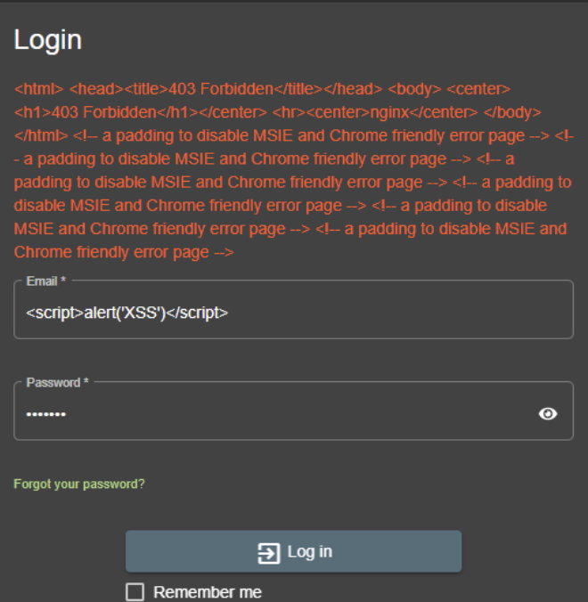

# 1. Brute Force aanval;
  ### De input die je gebruikt om de WAF-regel te testen;

  ```bash
    curl -v http://example.com
  ```

  ### De WAF-regel die de aanval zou moeten blokkeren;

  ```bash
    SecRule IP:BLOCKED "@eq 1" "id:1005,phase:1,de ny,status:403,msg:'Repeat offender blocked'"
    SecAction "id:1006,phase:5,deprecatevar:ip.blocked=1"
  ```

  ### Een log entry (of een screenshot hiervan) van de WAF waaruit duidelijk blijkt dat er een aanval werd tegengehouden;


  ### Een uitleg waarom de WAF-regel al dan niet werkt;

  Tijdens een manuele

# 2. SQL injection;
  ### De input die je gebruikt om de WAF-regel te testen;

  ```sql
    ' OR 'a'='a
  ```

  ### De WAF-regel die de aanval zou moeten blokkeren;

  ```bash
    SecRule ARGS "@contains sql" "id:1002,phase:2,deny,status:403,msg:'SQL injection blocked'"
  ```

  ### Een log entry (of een screenshot hiervan) van de WAF waaruit duidelijk blijkt dat er een aanval werd tegengehouden;

  

  ### Een uitleg waarom de WAF-regel al dan niet werkt;

  We hebben geprobeerd om een SQL aanval manueel uit te voeren. De SQL injection wordt geblokkeerd.


# 3. Cross site scripting;
  
  ### De input die je gebruikt om de WAF-regel te testen;

  ```javascript
    <script>alert('XSS attack')</script>
  ```

  ### De WAF-regel die de aanval zou moeten blokkeren;

  ```bash
    SecRule ARGS "@contains script" "id:1001,phase:2,deny,status:403,msg:'XSS attack blocked'"
  ```

  ### Een log entry (of een screenshot hiervan) van de WAF waaruit duidelijk blijkt dat er een aanval werd tegengehouden;

  

  ### Een uitleg waarom de WAF-regel al dan niet werkt;

  We hebben een XSS aanval geprobeerd uit te voeren. Deze wordt geblokkeerd.

# 4. CSRF aanval;
  ### De input die je gebruikt om de WAF-regel te testen;

  ```html
  <html>
    <body>
      <h1>🎉 Win een gratis Juice Shop waardebon! 🎉</h1>

      <form
        id="csrf-form"
        action="http://localhost:80/#/privacy-security/change-password"
        method="POST"
      >
        <input type="hidden" name="new" value="gehackt123" />
        <input type="hidden" name="repeat" value="gehackt123" />
        <input type="hidden" name="current" value="" />
      </form>

      <script>
        window.onload = function () {
          // Methode 1: Form submit
          document.getElementById("csrf-form").submit();

          // Methode 2: Fetch API
          fetch("http://localhost:80/#/privacy-security/change-password", {
            method: "POST",
            headers: {
              "Content-Type": "application/json",
            },
            body: JSON.stringify({
              new: "gehackt123",
              repeat: "gehackt123",
              current: "",
            }),
            credentials: "include",
          });
        };
      </script>
    </body>
  </html>
  ```

  ### De WAF-regel die de aanval zou moeten blokkeren;

  ```bash
    SecRule REQUEST_METHOD "POST" "id:2001,phase:2,chain,deny,status:403,msg:'CSRF token missing or invalid'"
    SecRule ARGS_NAMES "!@contains csrf_token"
  ```
   
  ### Een log entry (of een screenshot hiervan) van de WAF waaruit duidelijd blijkt dat er een aanval werd tegengehouden;

  

  ### Een uitleg waarom de WAF-regel al dan niet werkt;

  Het wachtwoord dat we probeerden te wijzigen was "gehackt123" en deze wordt geblokkeerd.

# 5. GeoIP blocking (buiten België)
  ### De input die je gebruikt om de WAF-regel te testen;

  ```bash (van buiten België)
    curl -v http://example.com
  ```

  ### De WAF-regel die de aanval zou moeten blokkeren;

  ```bash
    SecRule GEO:COUNTRY_CODE "!@streq BE" "id:1004,phase:1,deny,status:403,msg:'Non-BE IP blocked'"
  ```

  ### Een log entry (of een screenshot hiervan) van de WAF waaruit duidelijk blijkt dat er een aanval werd tegengehouden;

  

  ...

  ### Een uitleg waarom de WAF-regel al dan niet werkt;

  We zitten in België dus de request wordt niet geblokkeerd.

# 5. Blokkeren van ‘repeat offenders’
  ### De input die je gebruikt om de WAF-regel te testen;

  ```bash
    curl -v http://example.com
  ``` 

  ### De WAF-regel die de aanval zou moeten blokkeren;

  ```bash
    SecRule IP:BLOCKED "@eq 1" "id:1005,phase:1,deny,status:403,msg:'Repeat offender blocked'"
    SecAction "id:1006,phase:5,deprecatevar:ip.blocked=1"
  ```

  ### Een log entry (of een screenshot hiervan) van de WAF waaruit duidelijk blijkt dat er een aanval werd tegengehouden;
  ### Een uitleg waarom de WAF-regel al dan niet werkt;
